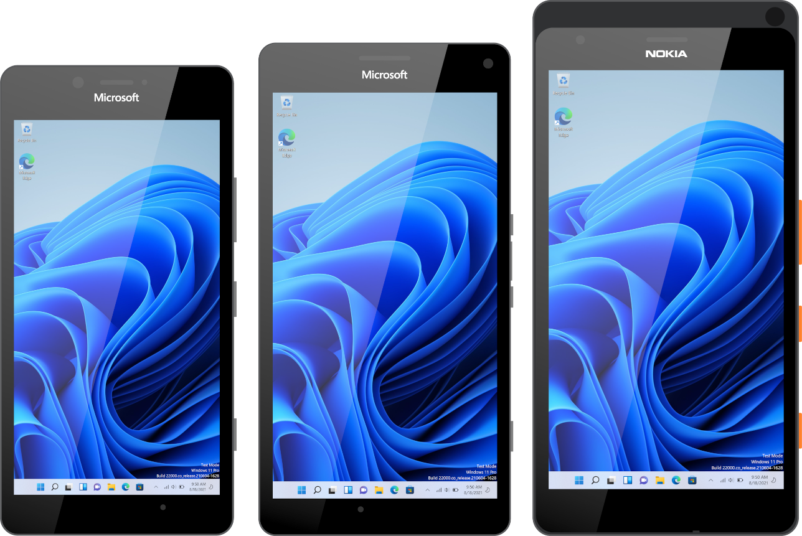
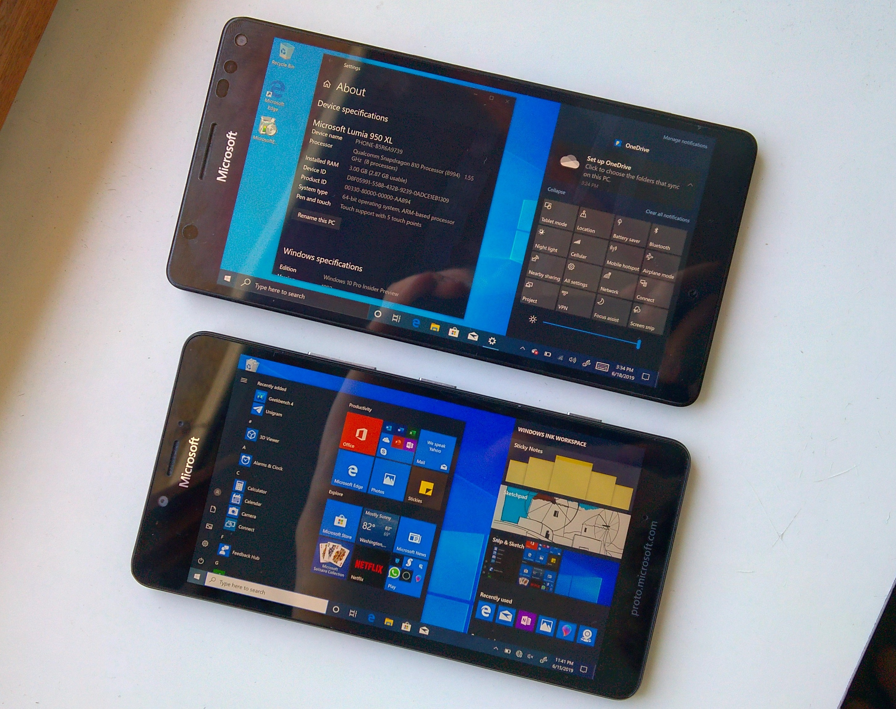

# Windows Driver pack for Lumia platforms



This repository contains driver binary files for most Lumia platforms released by Microsoft Mobile Oy from 2011 to 2016.
All driver binary files form a board support package to be used on Lumia devices to provide hardware support for the Windows operating system.

These driver files are not perfect, typos may exist, feel free to file an issue on GitHub in case you found any.
This repository isn't complete due to the lack of hardware. While we could theoretically add the missing devices, we want to verify the driver files indeed work on the target device. This is why some devices are not present.

## Resources

[Telegram group for ARM64](https://t.me/joinchat/C-AWlUUp3wxdcLRKwNOYsA)

[Telegram group for ARM32](https://t.me/joinchat/C-AWlVMh3jq0tnvPpLAS0Q)

[Guides](https://woa-project.github.io/LumiaWOA/guides/)

[WOA Deployer for ARM64 and 950 devices](https://github.com/WOA-Project/WOA-Deployer-Lumia)

[WPInternals for unlocking the bootloader of Lumia devices](https://github.com/ReneLergner/WPinternals/releases)

[Old repository Wiki containing some information about this project](https://github.com/WOA-Project/MSM8994-8992-NT-ARM64-Drivers/wiki)

## Copyright, License, Disclaimers and end user license agreement

**Below notice must be present in all redistributed portions of this software**

Copyright (c) 2017-2021 WOA-Project

Copyright (c) 2011-2016 Qualcomm Incorporated

Copyright (c) 2011-2016 Microsoft Mobile Oy

This repository contains binary files, most of which are not made by us and were found on an engineering board firmware that leaked in 2017 for arm64, as for the rest they come from publicly available firmware files from Software Repository. Some drivers, services, apps and all INF files were made by the WOA-Project team. As some mistakes may exist, we cannot provide warranty of any kind. 

- By installing this driver pack, you agree that any damage done to your phone or any loss of data is your entire responsibility and we cannot be taken responsible for data loss if it ever happens. We believe however this driver pack is safe to install. Try at your own risk!

- Charging an extra fee for a phone where you would have installed those drivers and you are selling online or to users is immoral and illegal due to where those drivers come from. An end user may not know how to update their system in the future and will most likely spent a lot more than what it should have for a driver pack he can find for free online. Selling a device with an extra fee also ruins the work of others that worked on this project. While we can't enforce this policy, we decided to put this notice here in the hopes of some people understanding the morality of this.

**Cellular disclaimers**

This Board Support package provides Cellular support to just ARM64 platforms due to software limitation with the Windows Operating System.

Cellular support will be almost functional as long as the following notice is met:
```
We've also been telling people on engineering devices to make backups, this is especially true here.

Flashing an entire eMMC image on engineering devices will not only risk damaging the device, it will also lose for *ever* the modem partitions for *your* phone.

Those are unique, there's ways to recover them but it's borderline legal. If you do not have the correct modem partitions for your device, you will *never* get Cellular to work on your device.

You have been warned.
```

**Contributors**

We would like to thank the following people that helped:

```
- ADeltaX

- Googulator

- gus33000

- imbushuo

- @never_released

- Heathcliff74 for WPInternals

- Our friends in China that worked hard to bring the Hapanero ARM64 firmware into the public

and that provided test hardware for us.

- Our testers, you know who you are :)

- The Windows RT Lumia projects

- Qualcomm and Microsoft

- and many other friends and contacts which would be too long to list here
```

The above copyright notice and this permission notice shall be included in all

copies or substantial portions of the Software.

THE SOFTWARE IS PROVIDED "AS IS", WITHOUT WARRANTY OF ANY KIND, EXPRESS OR

IMPLIED, INCLUDING BUT NOT LIMITED TO THE WARRANTIES OF MERCHANTABILITY,

FITNESS FOR A PARTICULAR PURPOSE AND NONINFRINGEMENT. IN NO EVENT SHALL THE

AUTHORS OR COPYRIGHT HOLDERS BE LIABLE FOR ANY CLAIM, DAMAGES OR OTHER

LIABILITY, WHETHER IN AN ACTION OF CONTRACT, TORT OR OTHERWISE, ARISING FROM,

OUT OF OR IN CONNECTION WITH THE SOFTWARE OR THE USE OR OTHER DEALINGS IN THE

SOFTWARE.


## Project Status



Refer to https://woa-project.github.io/LumiaWOA/status/ for status for Lumia 950 and Lumia 950 XL devices running ARM64 Windows.

## Installing manually

For preserving charset encoding, please checkout with using:

```
git clone -c core.autocrlf=false https://github.com/WOA-Project/Lumia-Drivers
```

### Drivers

Refer to https://github.com/WOA-Project/MSM8994-8992-NT-ARM64-Drivers/wiki/Installing-drivers-manually.

### Hapanero

To install on Hapaneros using Qualcomm's UEFI, refer to https://github.com/WOA-Project/MSM8994-8992-NT-ARM64-Drivers/wiki/Getting-started-on-Hapanero-(Qualcomm-UEFI). It is highly recommended to avoid using this on EB2 Hapanero devices, and using Lumia950XLPkg instead.
