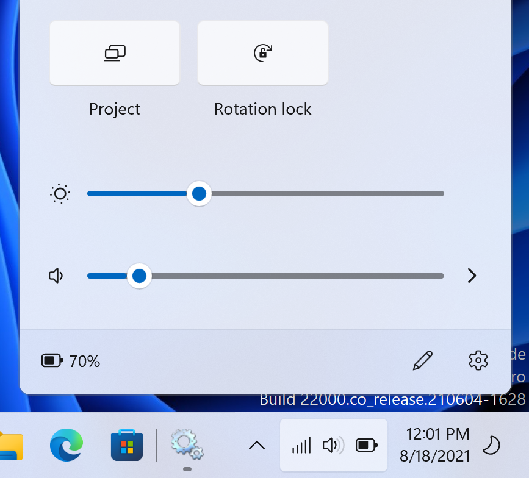

## Lumia Drivers BSP - Version 2107.12
**Released:** 07/04/2021 11:00 PM UTC+1

**Quality:** Preview

### Important installation notes

Please make sure your battery is fully charged before installing this driver pack. For most batteries the charge must be 100% as the phone may shutdown during setup if the battery is even at 80% charge.
Make sure battery is charged to 100% before continuing. If this is not the case, reboot your device **now** and charge it in an **Operating System**.

Reminder: if you are using WOA Deployer, **please** do not use the "Force Dual Boot" button, otherwise the setup process
will FAIL.

### Release notes

____________________________________________________________________________________________________________________________

Changelog

- FactoryOS (22000.1) support
- General updates to built in applications for Windows 11
- Removes custom theme on clean installs
- Addresses an issue with the Dialer application on Windows 11

____________________________________________________________________________________________________________________________

How to offline update an existing Windows Desktop installation

- Switch the device into mass storage.
- Take note of the drive letter the Windows partition is using, here we will assume it got mounted as I:

- Download [Lumia-Drivers-Full.zip] from https://github.com/WOA-Project/Lumia-Drivers/releases/latest
- Extract said zip file to a folder of your choice, we will assume here we extracted it to C:\UpdatedDrivers
- Download the DriverUpdater utility from https://github.com/WOA-Project/DriverUpdater/releases/latest
- Open a command prompt as administrator, where the driver utility got downloaded

- If your device is a Lumia 950, execute the following command:
  
  DriverUpdater.exe C:\UpdatedDrivers\Lumia-Drivers-XXXX\definitions\Desktop\ARM64\Internal\950.txt C:\UpdatedDrivers\Lumia-Drivers-XXXX\ I:\

- If your device is a Lumia 950 XL, execute the following command:
  
  DriverUpdater.exe C:\UpdatedDrivers\Lumia-Drivers-XXXX\definitions\Desktop\ARM64\Internal\950xl.txt C:\UpdatedDrivers\Lumia-Drivers-XXXX\ I:\

- Reboot the device, the device will now begin PnP setup once again, and hopefully you will be back soon enough to your desktop

____________________________________________________________________________________________________________________________

How to install Windows Desktop on internal Storage

- Please follow the steps detailed at https://woa-project.github.io/LumiaWOA/guides/

____________________________________________________________________________________________________________________________

Hardware specific defects

- A considerable amount of Lumia 950 and Lumia 950 XL devices do not work with the HP lapdock properly when using a wired connection

____________________________________________________________________________________________________________________________

General software defects

- Under certain circumstances, the Lumia 950 (''Talkman'') may fail to reboot properly. Shut down the device via other means (Developer Menu / Flash App & THOR2). This happens during Setup, where the device will display a black screen
- Cameras are not available
- Windows Hello Iris Scanner is not available
- Hyper-V is not available
- SD Card Boot is not available
- Battery life is degraded
- GPS stack is not using any sensor for navigation
- Miracast is not functional with many wireless devices, but works fine on Xbox, and Windows 10 computers
- Graphical glitches can be observed with acrylic effects on builds lower or equal than 20100
- Graphical glitches can be observed on shadows
- MTP may fail to start if the device is plugged a second time, stop the NcsdService to fix the issue via task manager
- Dual SIM devices are unsupported for Cellular, do not expect cellular to work properly on these
- DirectX is unavailable for x86 and amd64 applications
- Microphone level under Settings is stuck at 50%
- Phone may not boot reliably or have random reboots when the battery falls below 50% on certain devices, if all cores are enabled.
  As a workaround, you can run "bcdedit /set numproc 4" to disable the second core cluster

- No VoLTE
- No VoWiFi
- No Cellular data sharing
- Phone Calls require manual provisioning by the user on builds higher than 18908
- Text messages are unavailable on builds higher then 18908
- Some users might end up being unable to send texts on build 18908 and lower. To address this issue, open regedit on
  the device, go to HKLM\SOFTWARE\Microsoft\Messaging\IMEISpecific (or IMSISpecific), right click, go to security
  Tap advanced, tap change owner, in the dialog that opens, enter "Everyone" (without the quotes), tap check names
  press ok, press ok. Tap ALL APPLICATION PACKAGES, select 'full control', do the same for other listed accounts (optionally)
  Apply, and close regedit.
- An APN might be required to specify for some users in order to get cellular data working.

- Cellular is unavailable on builds lower than 17672.
- Some drivers and mainly sensors will not be working on RS3 (16299).

- Current issues with glance screen:

When the glance screen times out after the time specified there's a chance the screen won't turn off, this is still needing investigation but the issue can only be two things:
— either the device got out of S0ix and is sleeping at a lower level, because wifi is not connected for example, as a result the glance service is unable to take actions, this is a problem
— or, the glance service is trying to clear the screen, (there's a specific panel driver command to do so), and for some reason this is failing.
This specific issue might take some time to completely iron out.

The following status notifications are not implemented in the port/non functional in the wrapper libraries:
— Battery saver indication
— Ringer indication (vibrate on, silence on)
— Alarm indication
— Detailed text indication
— Notification badges

The following functionality is not implemented:
— Wake glance on single tap

____________________________________________________________________________________________________________________________

Deprecation notice

- Support for Build 18363 has ended, we cannot guarentee anymore that things will continue to work due to ongoing testing being halted.
  18363 and lower are over 3 years old. Please upgrade to 19041 or higher.

- Night light is broken on 18363 and lower [Won't fix, <= 18363 is deprecated, see above]

____________________________________________________________________________________________________________________________

Windows 10 software defects

- Applications do not get installed if the user reboots the device on first boot before completion or if the date and time settings are incorrect during OOBE (Out Of Box Experience).
  As a workaround, find the "Second Party Application Provisioner" application in the start menu, right click, run as administrator
- System reset is not supported
- First boot can have bad thermal performance due to Windows initial app installation.
  While leaving the phone plugged in to a wall charger, let it install all applications, all app updates through the store, and OneDrive. Then let the phone cool down

____________________________________________________________________________________________________________________________

Windows 10X software defects

- Vibration is unavailable
- Under certain circumstances, Windows may fail booting on talkman devices when AutoChk runs (repairing drive at boot). If this is your case, let the device reboot a couple of times, or reflash the FFU file til the issue vanishes
- Second Party Apps are not available
- Cellular data is unavailable

____________________________________________________________________________________________________________________________

### Bug reporting

This release is a Preview release. Bug exists and may happen. If you notice a bug not present in the following bug list, please report them on our Telegram Group.

-- WOA-Project Team