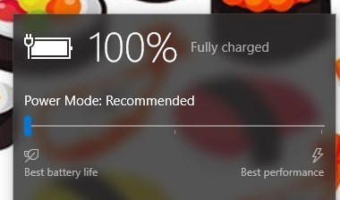

## Lumia Drivers BSP - Version 2101-prerelease
**Released:** 01/10/2021 07:40 PM UTC+1

**Quality:** Preview

### Important installation notes

Please make sure your battery is fully charged before installing this driver pack. For most batteries the charge must be 100% as the phone may shutdown during setup if the battery is even at 80% charge.
Make sure battery is charged to 100% before continuing. If this is not the case, reboot your device **now** and charge it in an **Operating System**.

### Release notes

 ¯\_(ツ)_/¯
 ¯\_(ツ)_/¯
 ¯\_(ツ)_/¯

### Bug reporting

This release is a Preview release. Bug exists and may happen. If you notice a bug not present in the following bug list, please report them on our Telegram Group.

-- WOA-Project Team